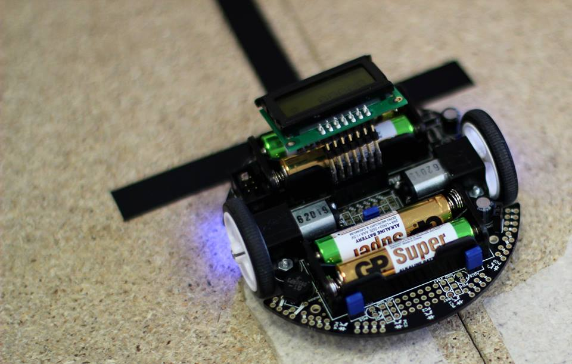
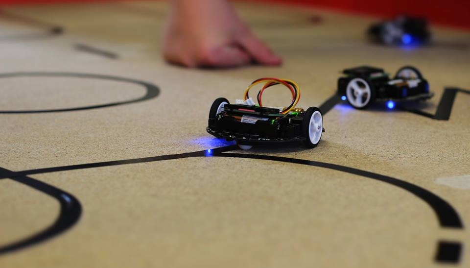
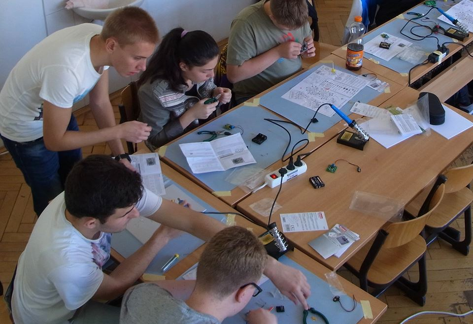
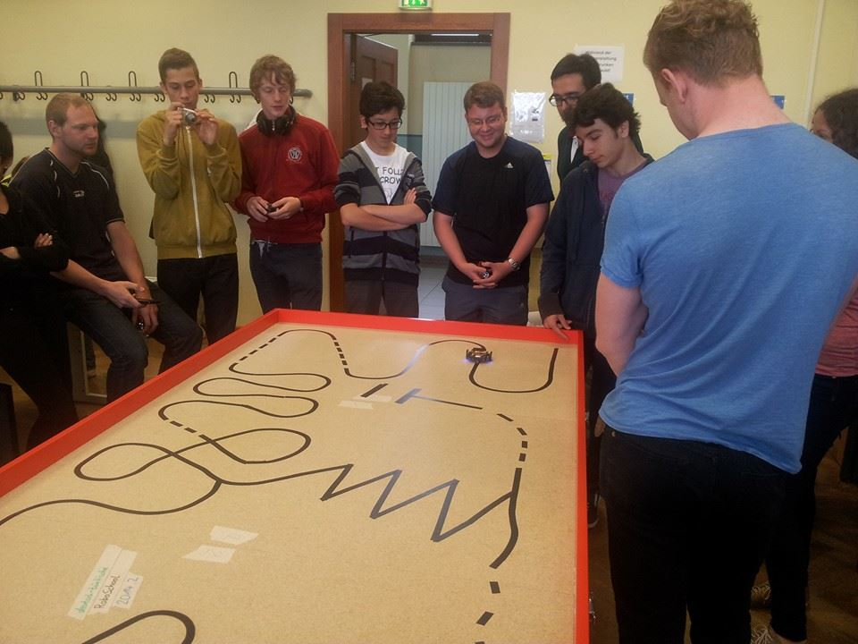
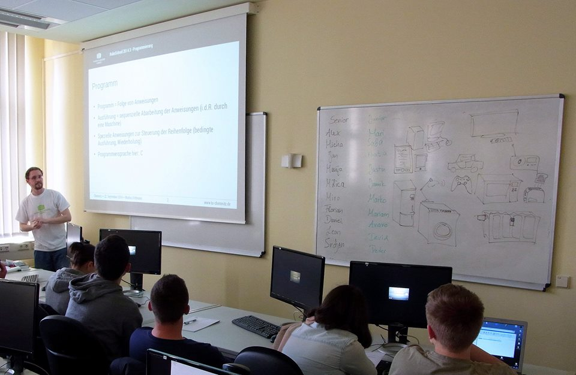

# robo-school
*Created October 3rd, 2014*

RoboSchool is a workshop organized by the Technical University of Chemnitz, where high school students learn the basics of robot programming and electronics. The workshop aims to foster team spirit and cross-cultural friendships among the participants. This program was created and used by the team that won the second place at RoboSchool 2014. The task was to get a Pololu 3pi robot to follow a black line on the ground.

[Read more about RoboSchool 2014](https://www.tu-chemnitz.de/tu/pressestelle/aktuell/6091)

|  |    |      |
| :---------------------------: | :-----------------------------------: | :-----------------------------: |
| *The Polulu 3pi bot up close* | *The robot completing the challenge*  | *Learning to solder*            |

|             |         |
| :----------------------------------: | :----------------------------------------: |
| *The parcour the robot had to solve* | *Getting an introduction to C programming* |
